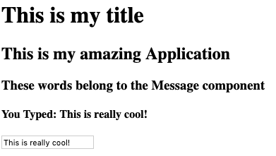

# LAB - Props and State

This lab is an opportunity to practice passing props and state between components. Its also the first refactoring of a "To Do List" application.

## Before you begin
Refer to *Getting Started*  in the [lab submission instructions](../../../reference/submission-instructions/labs/README.md) for complete setup, configuration, deployment, and submission instructions.
## Getting Started

Starter code has been provided for you in the `/lab/starter-code` folder. There are 3 separate assignments, each with it's own folder.

Open [Code Sandbox](http://codesandbox.io) and Create a new application. When prompted, choose "From GitHub" and then paste in the URL to the correct starter code folder from your fork of the class repository.

You will be submitting the URL to this working sandbox as part of your assignment.

## Practice Assignments

**Pass down some text**

Begin with: `/lab/starter-code/practice`

* Create a new component called `<Message />` under `components/message.js`
* Import this into your `<App />` and render the Message component with an attribute called `text`, with the value "This is my amazing application"
* In the Message component, create a state property named `words`
* Set it's value to "These words belong to the message component"
* The Message component should render an `<h2>` displaying the value of the text property sent to it from the App component
* The Message component should render an `<h3>` displaying the value of the words property from it's internal state

**Pass through some text to a sub-sub component**

* In the `<App />` component, send an additional attribute to the `<Message />` component called "title", with the value "This is my title"
* Create a new component called `<Title />` in `title.js`
* Import this component into the `<Message />` component
* In the `<Message />` component, render the `<Title />` component above the `<h2>` and `<h3>` tabs you already have, setting an attribute named "text" with the value being the "title" property sent in from the `<App />`
* In the `<Title />` component, render an `<h1>` tag with the value of the "text" property sent in from the `<Message />` component

**Pass a method to work with external state**

* In the `<App />` component, create a state object in the constructor with a property called `input`
* In the `<App />` component, write a method called `sayIt()` that will take a string, and set the state property called `input` with that string.
* In the `<App />` component, send an additional attribute to the `<Message />` component called `action`, which sends a reference to the `sayIt` method.
* In the `<App />` component, send an additional attribute to the `<Message />` component called `input`, which sends `this.state.input`
* Create a new component called `<Form />` in `form.js`
* Import this component into the `<Message />` component
* Render this from `<Message />` with an attribute called `do` that is a reference to the `action` property sent to the `<Message />` component from the `<App /`
  * Note that what we've done here is to create a method in `<App />`, sent it to `<Message />` and then passed it along to `<Form />`
* In the `<Form />` component, render a `<form>` tag with an `<input>` element.
* The `<form>` should call a method `onSubmit` that will prevent the default behavior on the form.
* The `<input>` element should call a method `onChange` that will capture current value of the input field and then call the method sent in the `do` property with that value
  * This will bubble all the way up and run the `sayIt()` method in the `<App />`
* In the `<Message />` component, render an `<h4>` tag at the end, containing the value of the `input` property sent to it from `<App />`

When operational, your application should look like the image below, and the words you type should appear as you type them.

---

## To Do Application Refactor

Begin with: `/lab/starter-code/todo`

You will be refactoring this simple "To Do" application, written with HTML, CSS, Vanilla Javascript and Handlebars Templates in a React app.

* Create a new React application at [Code Sandbox](http://codesandbox.io)
* Replicate the functionality of the starter application
  * Add whatever is typed into the form to the list
  * Clicking an item changes it's 'complete' state
    * Use that to set a new class on the item for styling
  * Clicking the delete link removes the item from the list
* Some basic CSS has been provided in the starter code
  * Convert this to SASS

## Tests

Write mount/enzyme tests for each component in all assignments

## Assignment Submission Instructions
Refer to the the [lab submission instructions](../../../reference/submission-instructions/labs/README.md) for the complete lab submission process and expectations
