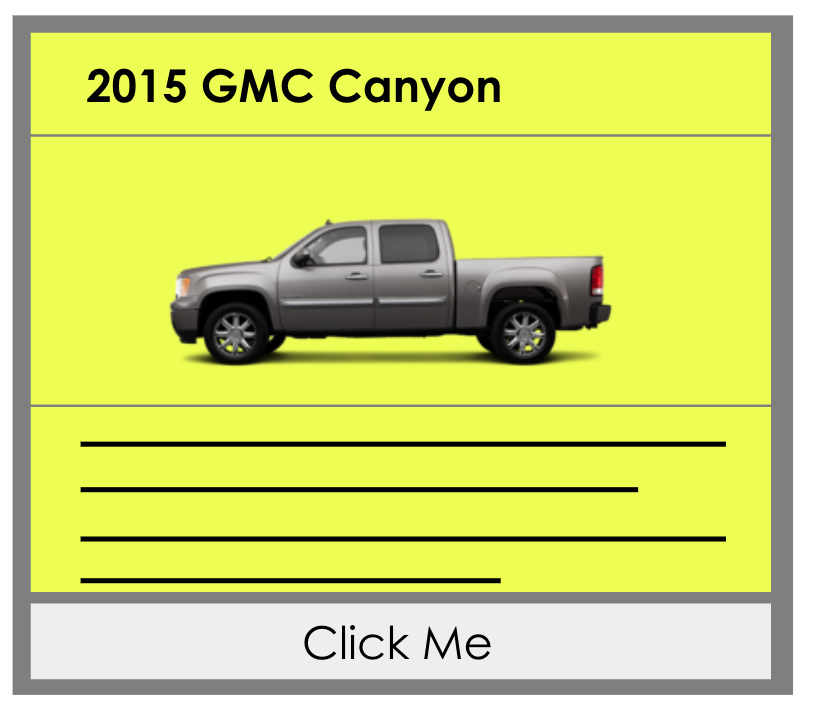
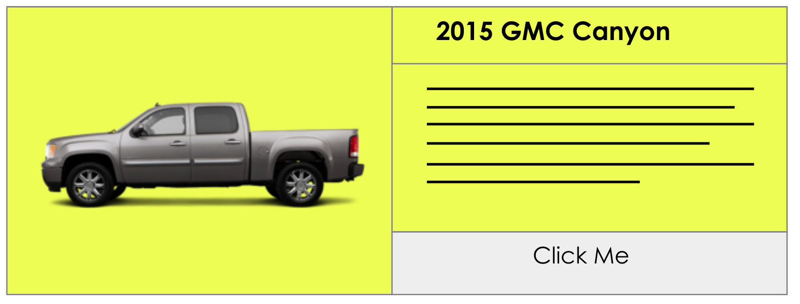

# DESIGN - Card Layouts and Styles


## Assignment
Begin Implementing Layouts using Cards and Decks. Decks are containers for cards. Specifically, a deck is a section, which contains cards, and optional a title and navigation.

```html
<div class="card">
    <header><h3>Title</h3></header>
    <figure>
        
        <figcaption>A Picture</figcaption>
    </figure>
    <div class="copy">...</div>
    <div class="links">
        <a class="primary" href="#">Primary</a>
        <a class="secondary" href="#">Secondary</a>
    </div>
</div>
```

A Deck's primary responsibility is to layout cards.








### Requirements

* From a markup standpoint ...
  * Decks are sections with a class of 'deck'
  * Cards are divs with a class of 'card'
* From a styling standpoint ...
  * Create card classes in a `_cards.scss` file in your core folder
  * This should contain layout options for deck content (header, nav) as well the cards for a few different layout options.
  * Assign classes such as `media-bottom`, `media-left', 'media-background', `wide`
  * Aside from the examples and notes given, come up with a few of your own.
  * More importantly, leave the door open in your implementation for more deck styles to be created as designs arise.

* To implement, you will need to edit the content.json file (which contains deck and card data) and add some different values for `type` for each card so that you can test styling.
