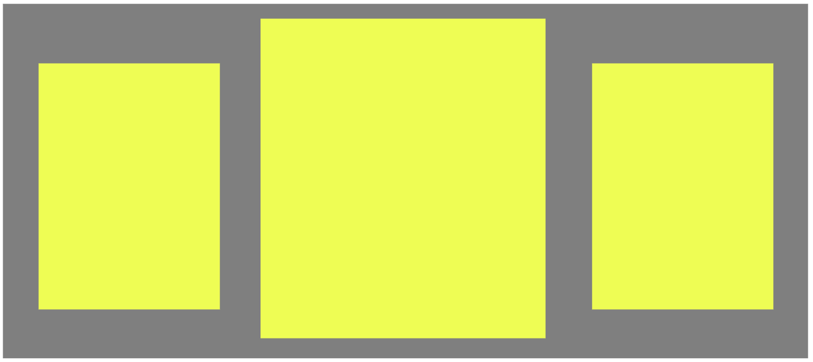
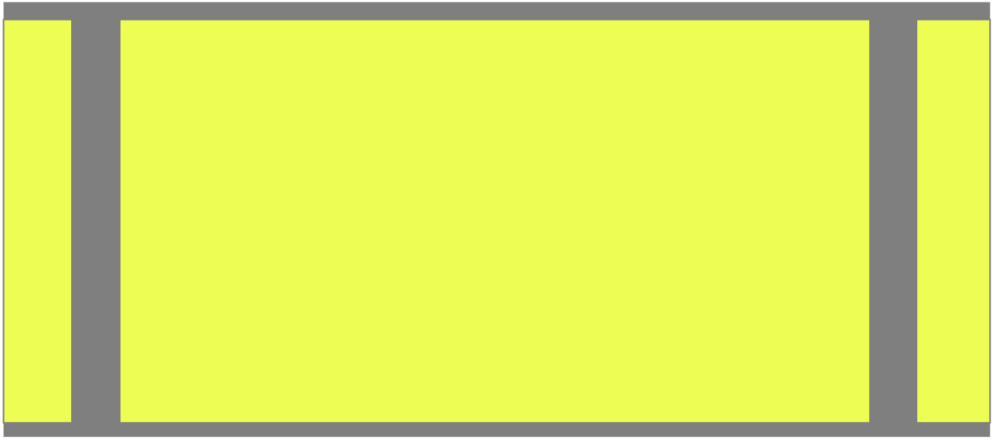

# DESIGN - Deck Layouts and Styles

## Assignment
Begin Implementing Layouts using Cards and Decks. Decks are containers for cards. Specifically, a deck is a section, which contains cards, and optional a title and navigation.

```html
<section class="deck">
    <header><h2>Title</h2></header>
    <nav>
        <ul>
            <li><a href='#card1'>Card 1</a></li>
            <li><a href='#card2'>Card 2</a></li>
        </ul>
    </nav>
    <div id="card1" class="card">...</div>
    <div id="card2" class="card">...</div>
</section>
```

A Deck's primary responsibility is to layout cards.







### Requirements
* From a markup standpoint ...
  * Decks are sections with a class of 'deck'
  * Cards are divs with a class of 'card'
* From a styling standpoint ...
  * Create deck classes in a `_decks.scss` file in your core folder
  * This should contain layout options for deck content (header, nav) as well the cards for a few different layout options.
  * Assign classes such as `grid`, `col-1, col-2, col-3`, `highlight`, etc to indicate different patterns for laying out the various components that make up a deck.
  * Aside from the examples and notes given, come up with a few of your own.
  * More importantly, leave the door open in your implementation for more deck styles to be created as designs arise.

* To implement, you will need to edit the content.json file (which contains deck and card data) and add some different values for `type` for each deck so that you can test styling.
